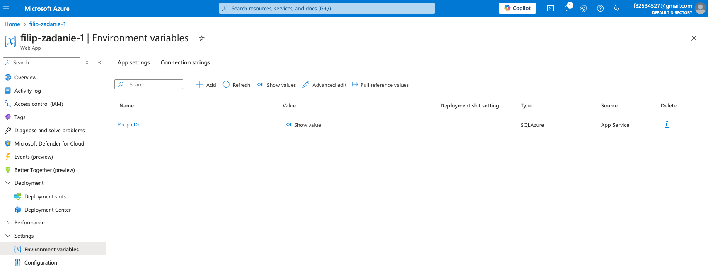

Zadanie z przedmiotu Systemy i platformy zarządzania treścią (L)

Według tutorialu: https://www.youtube.com/watch?v=qDl_rPHnlck

Wyhostowane na: https://filip-zadanie-1.azurewebsites.net/people

### Techonologie:

- C#
- .NET 8.0
- Entity Framework 8.0.3
- Azure Web Services
- Azure SQL database

### Screenshoty

