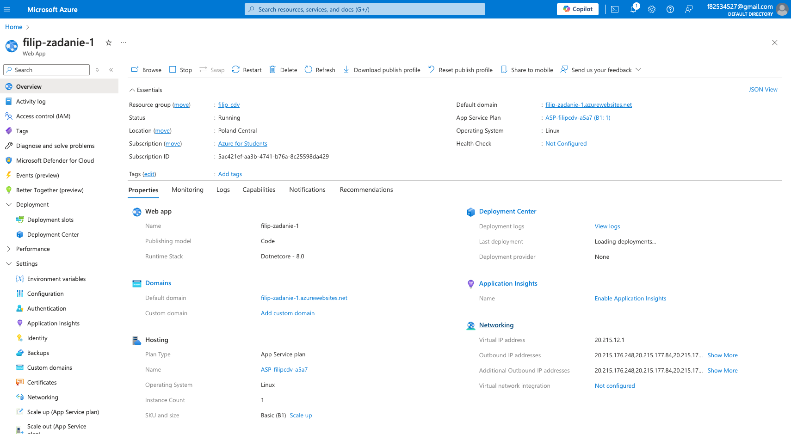
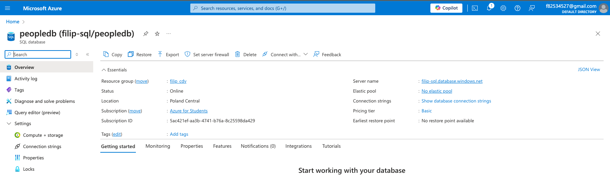
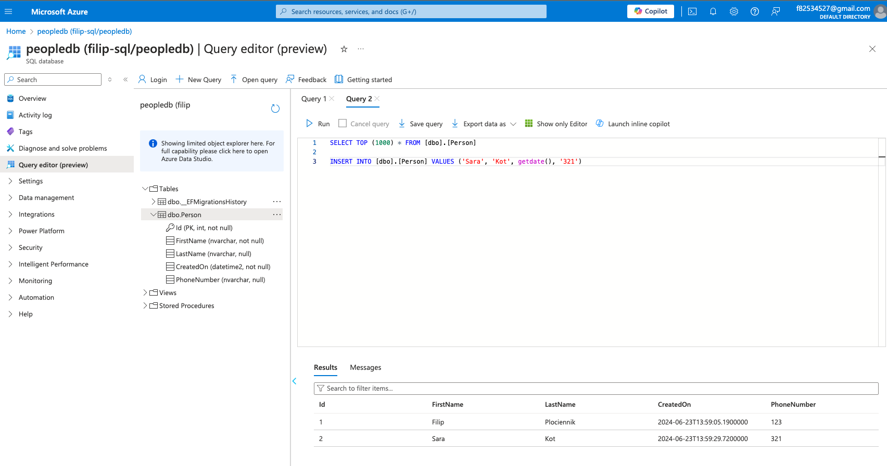
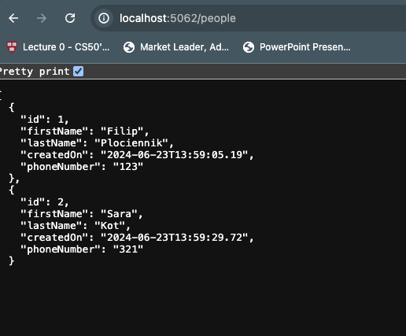
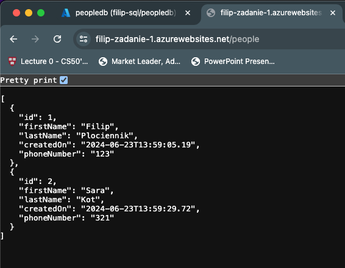

Zadanie z przedmiotu Systemy i platformy zarządzania treścią (L)
YT tutorial: https://www.youtube.com/watch?v=qDl_rPHnlck

### Techonologies:

\*C#

- .NET 8.0
- Entity Framework 8.0.3
- Azure Web Services
- Azure SQL database

### Screenshots

